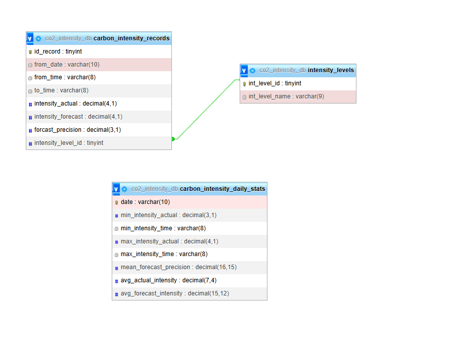

# ETL Process on Great Britain's CO2 Intensity API Data

This repository contains a Basic Python-based Extract, Transform, Load (ETL) pipeline designed to fetch, process, and store carbon intensity data. 

## Table of Contents
1. [Project Overview](#project-overview)
2. [Data Source](#data-source)
3. [ETL Pipeline Details](#etl-pipeline-details)
    * [Data Acquisition (Extraction)](#1-data-acquisition-extraction)
    * [Data Cleaning](#2-data-cleaning)
    * [Data Transformation](#3-data-transformation)
    * [Data Loading](#4-data-loading)
4. [Database Schema](#database-schema)
5. [Conclusion](#conclusion)

## Project Overview
This project implements a foundational ETL process to gather historical and forecasted carbon intensity data for Great Britain. The goal is to:

**Extract:** Retrieve daily carbon intensity data from the API.

**Transform:** Clean, enrich, and structure the raw data for analytical purposes and database storage. This includes deriving new metrics and aggregating daily statistics.

**Load:** load the transformed data into a SQLite database, organized into structured tables.

## Data Source
The primary data source is the [Official Carbon Intensity API for Great Britain](https://carbon-intensity.github.io/api-definitions/). This API provides real-time and forecasted carbon intensity data for the electricity grid in Great Britain. The _**intensity/date/{date}**_ endpoint is specifically used to retrieve intensity data for a given day.

## ETL Pipeline Details
The ETL process is broken down into four main functions: Data Acquisition, Data Cleaning, Data Transformation, and Data Loading.

1. **Data Acquisition (Extraction)**

    - _verif_date_validity(date)_: A helper function to validate that a given date string is in YYYY-MM-DD format and represents a valid calendar date. It returns the formatted date or None on failure.

    - _get_co2_intensity_data(date)_: is the function responsible for extracting raw data of a specific day from , and returning it in a dataFrame ready for the next step of the pipeline. This function returns the data from 23:00 of the previous day to 23:00 of the targeted day, which makes the data not reliable to be used in analytics. For this reason we defined.  

    - _get_co2_intensity_data_2days(date)_: to get the data of a day and the next one.

2. **Data Cleaning**

    - _clean_co2_intensity_data(dfs_list, date)_:ensuring the data is in the right types (example: datetime), filling the nan values of intensity with the forecasted, dropping duplicated records, normalizing the nested intensity data part of the response and returning the normalized/cleaned data of the 24hrs from 00:00 to 00:00.

3. **Data Transformation**

    - _transform__co2_intensity_data(cleanedData)_: extracting more data from the cleaned one (like getting from_date and from_time from ‘from’), creating forecast_precision = actual - forecast (helps evaluate the precision of predictions), transforming intensity_level to numbers for easier processing when it’s in the database. This function normalizes the main API data to be later on loaded in the records table.

    - _get_daily_co2_intensity_stats(transformedData)_: analysing the daily records and creating metrics. From the transformed data we get daily min, max intensities, precision, and intensities means. 

4. **Data Loading**

    - _create_database_schema(db_path)_: creating the database and its three tables (intensity_levels, carbon_intensity_records, and carbon_intensity_daily_stats ).

    - _load_data_to_carbon_intensity_records(data, db_path)_: filling the carbon_intensity_records table with the transformed main API data. 

    - _load_daily_stats_to_table(data, db_path)_: filling the carbon_intensity_daily_stats with the new daily metrics created. 

## Database Schema
The SQLite database (co2_intensity_db.db) is structured with the following tables:

## Conclusion: 
This project successfully established a functional end-to-end ETL pipeline for CO2 intensity data, serving as a foundational practical experience. It allowed me to get initiated with new concepts, work directly with real-time climate-related data to gain valuable insights.

## Author

**Hajar A**
* [GitHub Profile](https://github.com/Ha-neu-l)
* [LinkedIn Profile](https://www.linkedin.com/in/hajar-a-109a22229/) 